# Admission-Management-System

## Overview
This project is an Engineering College Admission System built using Java Servlets. The application enables students to apply for admission to an engineering college, view and update their profiles, and track the status of their application. Administrators can manage the applications, approve or reject them, and view application details.

## Features
### 1. **CheckEligibility Servlet**
-  The CheckEligibility function evaluates a student's application based on predefined eligibility criteria such as age.
- Allows authorValidate Students to apply for addmition.

### 2. **CheckLogin Servlet**
-  The CheckLogin servlet is responsible for handling the authentication process when a student attempts to apply for addmition . it uses the cookies and session for this.

### 3. **Database Connection**
- Helper class for providing the database connection

### 4. **Login Servlet**
- The Login Servlet is used to authonticate the user and set the cookie, for further process

### 5. **Logout Servlet**
- Used to Delete Cookie and redirect to the Login page

### 6. **Payment Servlet**
- The payment servlet is used to store the payment details into payments database and manage correspoding html page for payment

### 7. **Profile Servlet**
- profile servlet is used to diaplay the servlet for profile of the student

### 8. **StudentRegistration Servlet**
- StudentRegistration Servlet is used to manage all admission process of student like collecting the student data and inserting it      into  the database.

### 9. **Upload Servlet**
- for managing the uploadocuments page and upload and manage the documents of students.

### 10. **Screenshots**

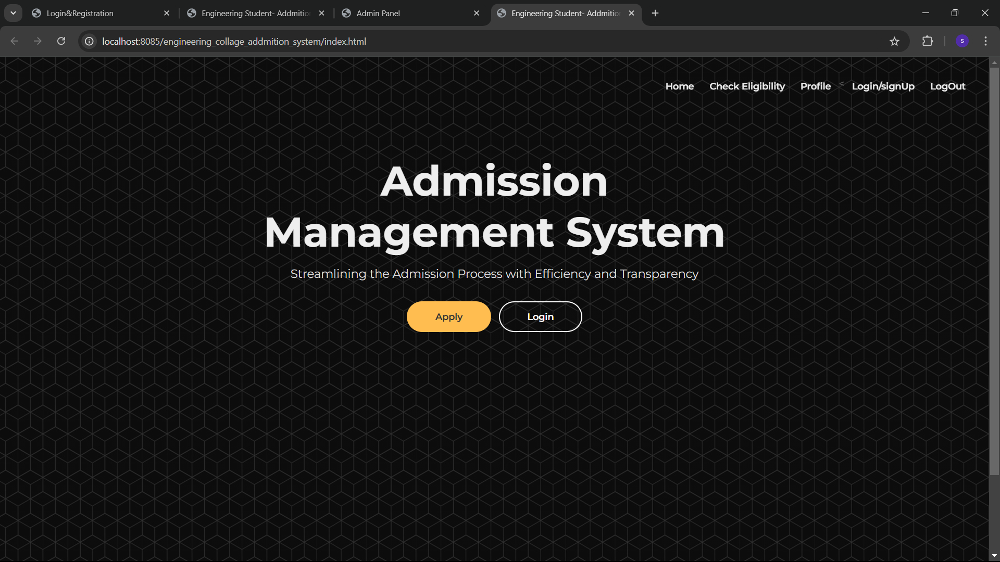

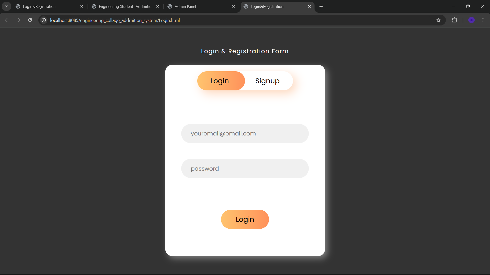

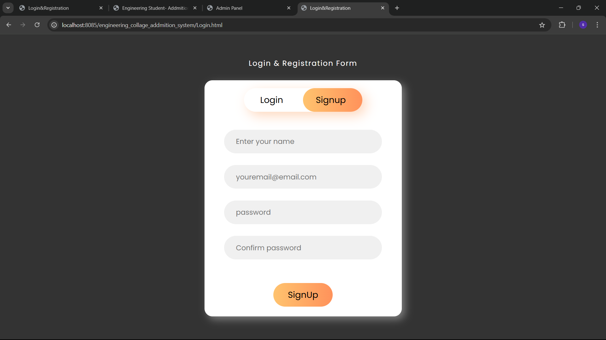

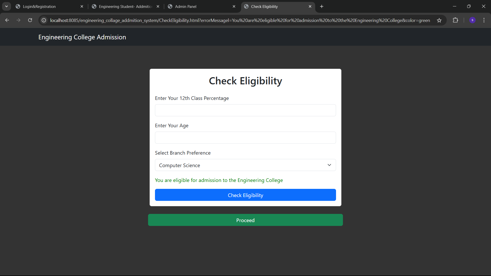

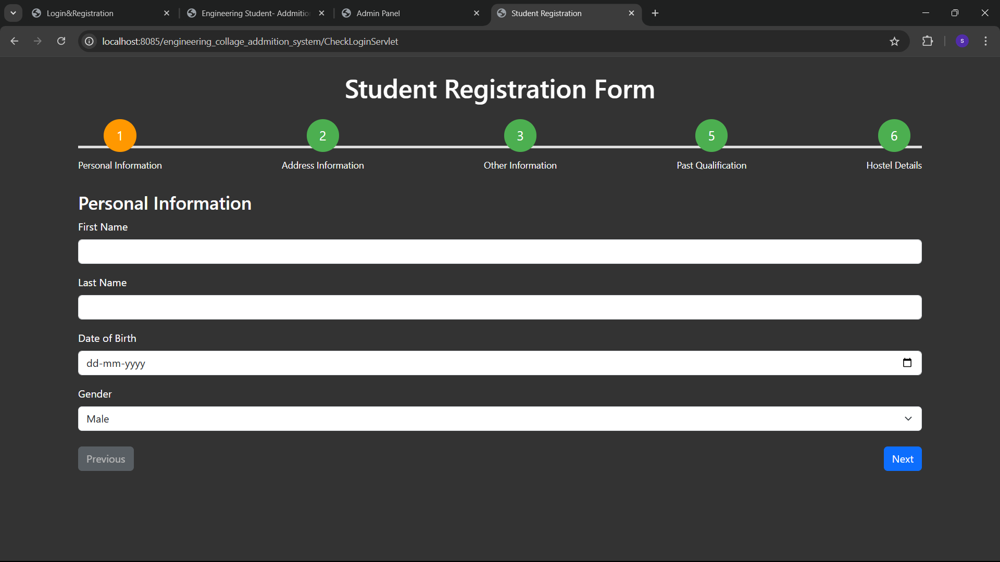

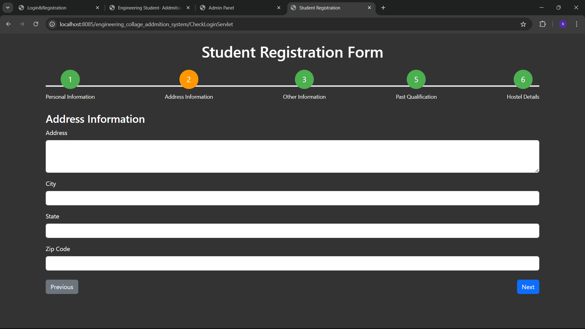

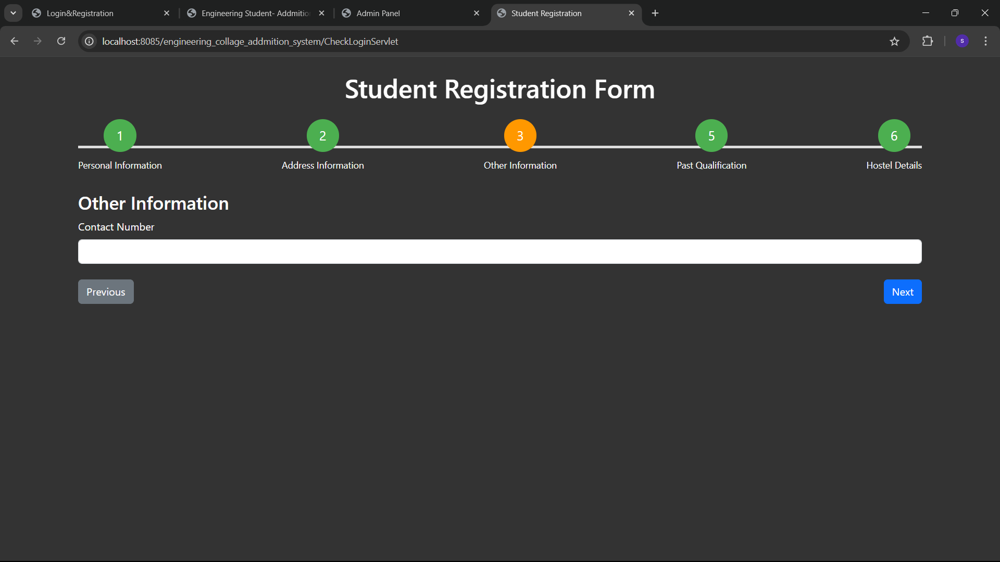

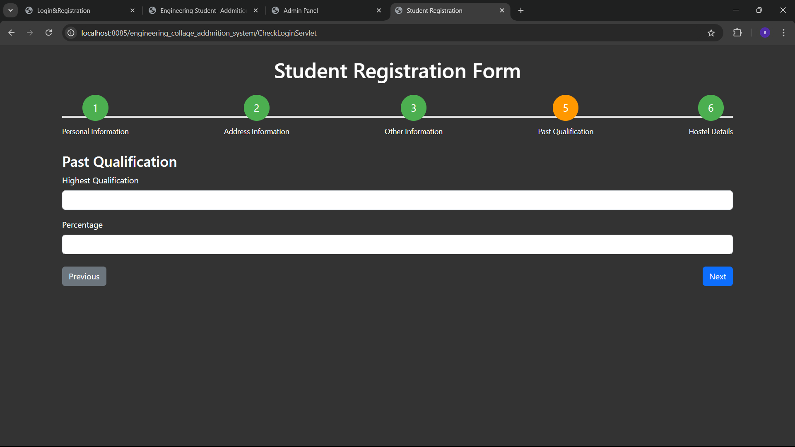

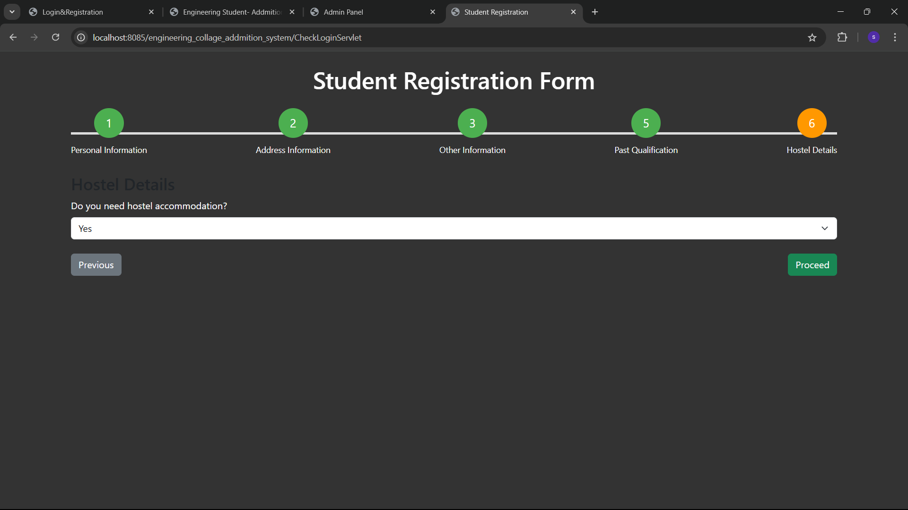

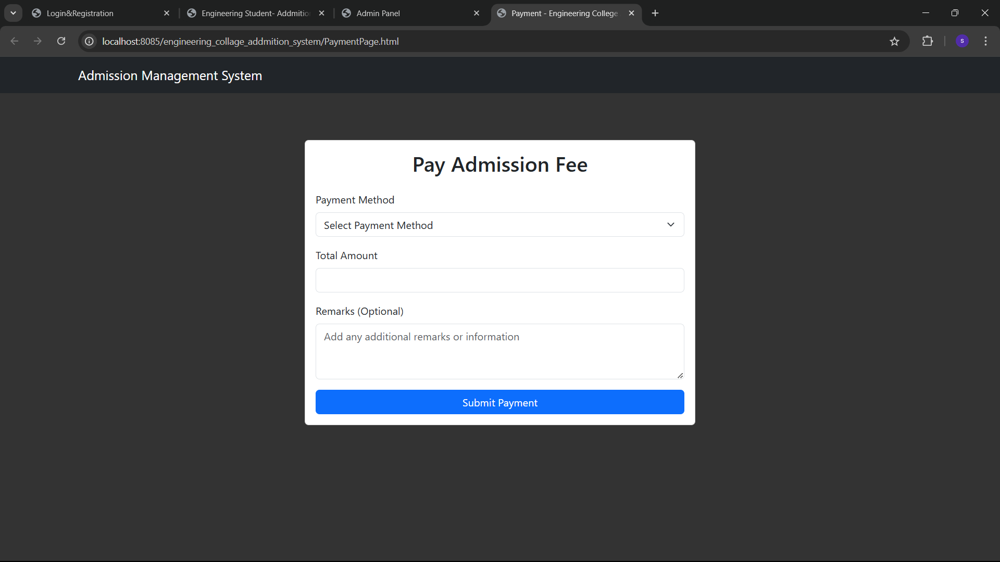

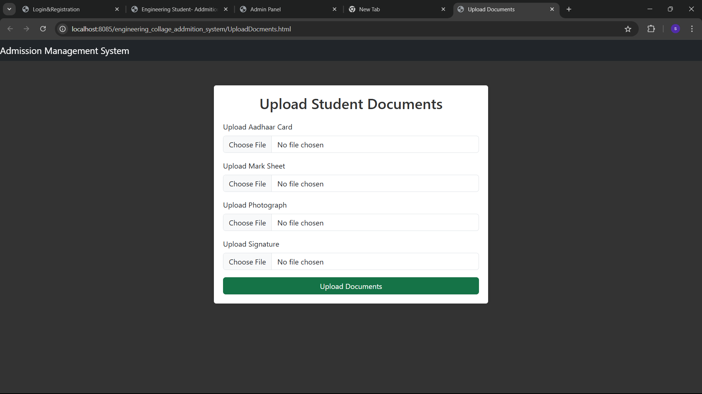

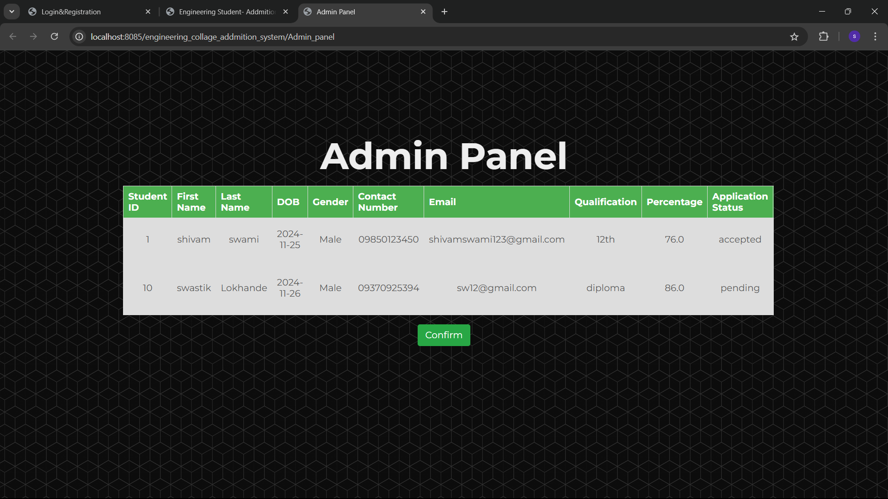

## Technologies Used
- **Backend**: Java Servlets
- **Frontend**: HTML, CSS, Bootstrap
- **Database**: MySQL
- **Server**: Apache Tomcat
- **File Uploads**: Handled using `javax.servlet.http.Part` 
